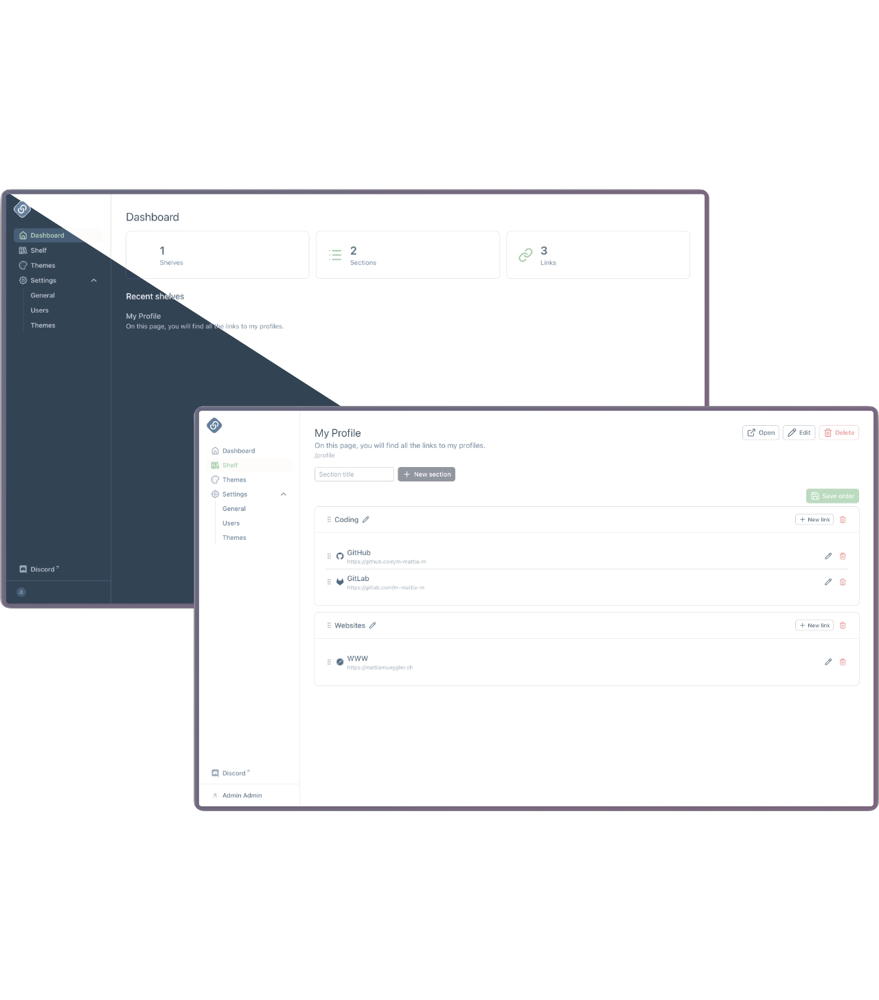

# LinkShelf

    

Open source Linktree alternative. Collect your links on a page (a *shelf*), style it, share it. Self-hosted.

## Features

**Shelves**

- Unlimited shelves, sections and links
- Drag and drop ordering
- Icons from Lucide and Simple Icons, optional color per link
- Share via URL or QR code
- Optional footer: default "Powered by LinkShelf", your own text (bold, italic, links), or none
- `noindex` per shelf to keep it out of search engines

**URLs**

- Path: `/<path>`
- User-based paths: `/<username>/<path>`, so two users can both own `/profile`
- Custom domain per shelf: `profile.example.com`

**Themes**

- 13 built-in themes
- Own themes: colors, gradients, font, corner radius, background image
- Import and export as plain text
- Instance themes from a mounted directory, plus static assets like background images
- Validated on save: no raw CSS, so themes are safe on public pages

**Accounts and auth**

- Local accounts or OIDC (Keycloak, Zitadel, Auth0, Google, ...)
- Email verification, password reset, invite by email (needs SMTP)
- Bootstrap admin from config
- Registration can be turned off

**Admin**

- Manage users: create, invite, edit, verify, delete
- Moderate user themes
- Edit About, Contact, Imprint, Terms and Privacy pages (Markdown, per language)
- Dashboard with shelf, section and link counts

**Self-hosting**

- One container image, frontend and backend together
- PostgreSQL or MySQL
- Helm chart, works on OpenShift
- Strict origins to lock the API to your instance
- OpenAPI spec and Swagger UI at `/swagger`
- UI in English, Deutsch and Schwiizerdütsch

## Quick start

1. Copy the compose file from the [Docker docs](frontend/content/docs/self-hosting/docker.md)
2. `docker compose up -d`
3. Open `http://localhost:3000`
4. Sign in with the bootstrap admin (`admin@example.com` / `change-me`), then change it

## Docs

- [Self-hosting](frontend/content/docs/self-hosting/getting-started.md)
  - [Docker](frontend/content/docs/self-hosting/docker.md)
  - [Kubernetes](frontend/content/docs/self-hosting/kubernetes.md)
  - [Configuration](frontend/content/docs/self-hosting/configuration.md)
  - [Custom domains](frontend/content/docs/self-hosting/custom-domains.md)
- [Usage](frontend/content/docs/usage/getting-started.md)
- [Helm chart](charts/linkshelf/README.md)

## Contributing and Development

See [CONTRIBUTING.md](CONTRIBUTING.md)
