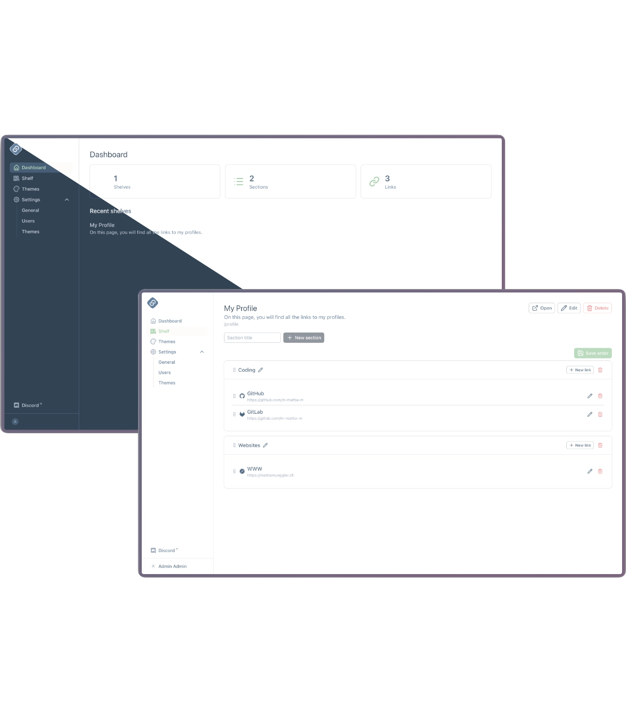

# LinkShelf

    

LinkShelf is an open source, self-hosted Linktree alternative. Collect your links on a page (a *shelf*), style it with a
theme and share it under your own URL or domain. It runs as a single container and is built to be deployed on Kubernetes
as well as with Docker Compose.

## Features

- **Unlimited shelves:** create as many shelves as you want and group links into sections.
- **Accounts:** local accounts or OIDC (Keycloak, Zitadel, Auth0, Google, ...). Registration can be turned off.
- **Own domains:** serve a shelf under `/<path>`, `/<username>/<path>` or its own custom domain.
- **Theming:** 13 built-in themes, user themes, and instance themes from a mounted directory.
- **Admin dashboard:** manage users, moderate themes and edit the About, Imprint, Terms and Privacy pages.
- **SMTP:** optional mail integration for verification, password reset and invites.
- **Responsive:** works on desktop and mobile.
- **Kubernetes:** Helm chart, works on OpenShift.
- **Database:** PostgreSQL or MySQL.
- **API:** OpenAPI spec and Swagger UI at `/swagger`.
- **Languages:** UI in English, Deutsch, Schwiizerdütsch and Español.

## Quick start

1. Copy the compose file from the [Docker docs](frontend/content/docs/self-hosting/docker.md) and create its `.env` with
   a random JWT secret and admin password (e.g. `openssl rand -base64 48`), as described there
2. `docker compose up -d`
3. Open `http://localhost:3000`
4. Sign in with the bootstrap admin you configured

## (Day-2) Operations

- **Upgrades:** bump the image or chart version. On startup the app applies pending database migrations itself
  (golang-migrate), nothing to run manually.
- **Rollback:** rolling back the chart rolls back the pods, not the database. It only works if the older version can
  still run on the migrated schema. Rollbacks are not tested yet.
- **Backup/restore:** all state is in the database (plus the optional mounted themes/assets directories). Back up the
  database with SQL dumps or your platform's tooling, e.g. CNPG with WAL archiving.
- **Multiple replicas:** the app is stateless, so `replicaCount > 1` works. Tested briefly with 3 pods, not yet
  thoroughly.

## Docs

- [Self-hosting](frontend/content/docs/self-hosting/getting-started.md)
    - [Docker](frontend/content/docs/self-hosting/docker.md)
    - [Kubernetes](frontend/content/docs/self-hosting/kubernetes.md)
    - [Configuration](frontend/content/docs/self-hosting/configuration.md)
    - [Custom domains](frontend/content/docs/self-hosting/custom-domains.md)
- [Usage](frontend/content/docs/usage/getting-started.md)
- [Helm chart](charts/linkshelf/README.md)
- [FAQ](frontend/content/docs/faq/index.md)

## Contributing and Development

See [CONTRIBUTING.md](CONTRIBUTING.md)

## License

LinkShelf is licensed under the [GNU AGPLv3](LICENSE). See [LICENSING.md](LICENSING.md) for details, exceptions and
trademark notes.
